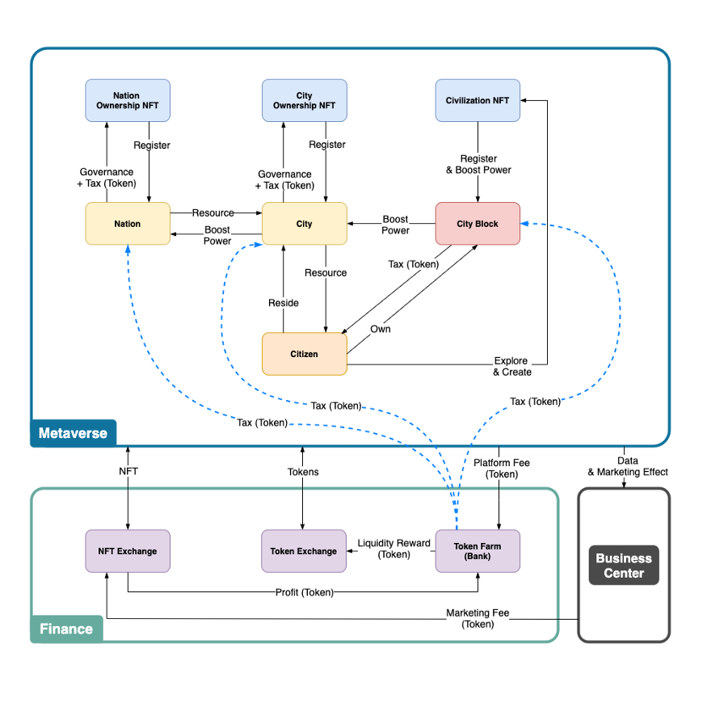

# Summary

## Metaverse.denations.com

Virtual world to run a Nation/City, develop Civilization NFTs and participate in various businesses.

## Finance.denations.com

DeFi platform. Business revenue and token revenue (NFT, DENA) are distributed to the NFT owners and liquidity providers via Token Farm to increase the liquidity and value of the token (NFT, DENA). Provides exchanges so that NFT and DENA can be actively traded.

## Business.denations.com

A platform for running real businesses such as reward marketing, data sales, and forecasting market based on Metaverse’s customers and data