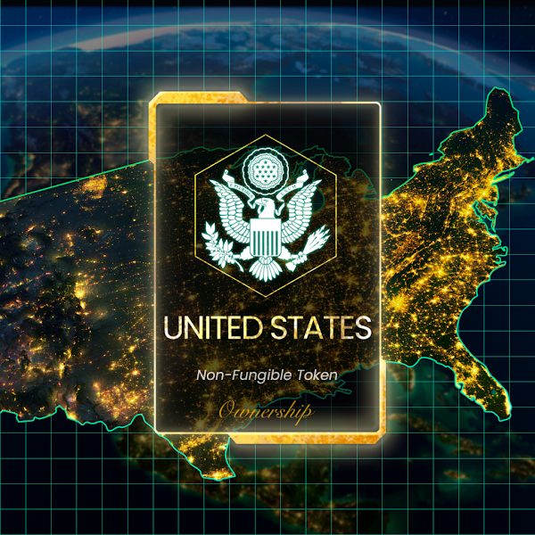

# Nation Ownership NFT

## Description

- This NFT represents ownership of the nation in DeNations.
- 20% of the Nation Ownership NFT sales will be collected as a national tax and distributed to the owners of the Nation Ownership NFT.

## DGDP

- DGDP is an indicator1 of national power in DeNations.
- The sale price of the Nation NFT is based on the 2019 DGDP while Tax rate reflects the current DGDP.
- DGDP is updated weekly and affects Tax(yield) Farming ability.
- Players can become a president of a country by registering the most Nation Ownership NFT cards.

## Usage

### Tax Farming

Register your Nation Ownerships (NFTs) and enjoy tax (yield) farming.

:::tip

The HIGHER DGDPs are registered, the MORE Tax (in DENA) you can earn.

:::

### Founder Tax

Early buyers will enjoy special Founder Tax.

1. **Definition & Source of Founder Tax:**

    10% of the nation ownership NFT sold per week is accumulated and distributed to players who registered at the beginning of the week.

2. **Founder Tax Distribution:**

    Discontinuance of supply rounds. Therefore, the founder tax will be distributed based on a weekly basis. The Founder Tax will be distributed every Monday.

3. **Register Nation Ownerships to Qualify:**

    You need to register your Nation Ownerships to qualify to receive Founder Tax.

4. **Exceptions:**

    DeNations Ownerships & Myanmar Ownerships are excluded.

### President Compensation

A President receives 20% of national tax and determines the national policy and executes the national budget.

:::tip

The EARLIER you become the owner, the MORE BENEFIT you will get.

:::