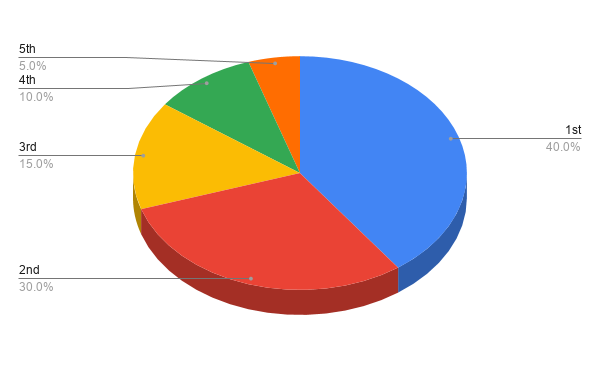

# NFT Reward Policy

## Nation Ownership NFT Reward

### Tax Farming

- Register your Nation Ownerships (NFTs) and enjoy tax (yield) farming.

:::tip

The HIGHER DGDPs are registered, the MORE Tax (in DENA) you can receive.

:::

### Founder Tax

Early buyers will enjoy special Founder Tax.

1. **Definition & Source of Founder Tax:** 

    10% of sales of ownerships per round are compensated to the ownership owners of the previous round. This reward is defined as the Founder Tax.

2. **Founder Tax Distribution:** 

    40% of the Founder Tax (Top 5 Founder Tax) will be allocated to the top 5 registered owners who own the most ownerships at the end of the previous round. 60% of Founder Tax (Normal Founder Tax) will be distributed in proportion to the number of ownerships registered at the end of the previous round. When there is a tie, the owner who registered their last ownership earlier takes the higher rank.

3. **Time of the Measurement:**

    The status of the registered Nation Ownerships is measured when the previous round ends (when the last Nation Ownership of the previous round is sold) and this determines distribution of the founder tax reward for the current round.

4. **Register Nation Ownerships to Qualify:**

    You need to register your Nation Ownerships to qualify to receive Founder Tax. Users who already registered their Nation Ownerships do not need to register twice.

    **[Register Ownerships →](https://play.denations.com/market)**

5. **Tax Reward Date:**

    The Founder Tax reward will be paid when the current round ends and new round starts (when the last Nation Ownership of the round is sold).

6. **Exceptions:** 

    DeNations Ownerships & Myanmar Ownerships are excluded. 

    Founder Tax is distributed according to the number of registered nation ownership owned at the end of the previous round.

    

    

**Example:** 

- John registered 50 Ownerships (out of 190 total registered) of France when the last France Ownership is sold for round 2 (end of round 2).
- John owns the 2nd largest number of France Ownerships at the end of round 2.
- 85 new France Ownerships are sold (which excludes resale) during the 3rd round.
- The total sales amount was 100 ETH.
- Founder tax reward for John at round 3 will be 1.39 ETH which includes.
- Normal Founder Tax (0.79 ETH=50 ETH*10%*60%*(50/190)) and Top 5 Founder Tax (0.60 ETH=50 ETH*10%*40%*30%)

### President Compensation

- A President receives 20% of national tax and determines the national policy and executes the national budget.

## Art NFT Reward

### Art Farming

[Art Farming(Farm with NFT)](/docs/guide/play-to-earn/Art%20Farming) 

### **Block Reward**

20% of DeNations Fund generated from current block NFT sales is distributed to the NFT arts owners of previous blocks. The Block Reward is designed to give incentives to two parties below.

1. Early NFT art collector: The collector who buys NFTs in the block will enjoy continuous Block Rewards for every block connected after the block.

2. DeNations Art Committee: In order to make the Art NFT of the previous blocks more valuable, the committee (including artists from the previous block) needs to recruit talented NFT artists and assign an optimal Art Index which will maximize next block sales.

:::info Information

Only Block Rewards of more than 10 USD are paid, and blockchain fees can be deducted from rewards upon transmission. 

:::‍