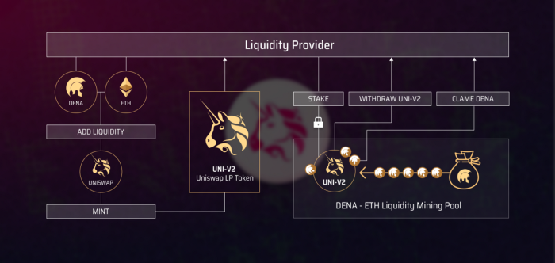

# Liquidity Farming

## Finance platform



```mdx-code-block
import {ExternalLinkCard} from '@site/src/components/Link/Card'

<ExternalLinkCard title="Decentralized Nations | DENA APP" to="http://finance.denations.com/#/dena" style={{margin: '1rem 0'}}/>
```

## Description

DeNations distributes a certain # of DENA to the liquidity provider of DENA and other major tokens such as ETH, DAI, and WBTC in proportional to their provided liquidity size. This is intended to increase the liquidity and value of the DENA token, which is a key driver of the DeNations ecosystem.

1. Add liquidity to qualified liquidity pools that reside in Uniswap.
2. Receive LP (Liquidity Provider) token from Uniswap in exchange for adding liquidity.
3. Stake LP token to Finance.denations.com
4. Receive DENA in proportional to the size of staked LP token.

## Liquidity Farms

**Participating farms are...**

1. **DENA-ETH** Liquidity Farming Pool **[Add Liquidity](https://app.uniswap.org/#/add/v2/0x15F0EEDF9Ce24fc4b6826E590A8292CE5524a1DA/ETH)**
    1. **Farming Rate:** 1,112 DENA per week
    2. **Staked LP Token:** DENA-ETH Uniswap V2 LP token
2. **DENA-DAI** Liquidity Farming Pool **[Add Liquidity](https://app.uniswap.org/#/add/v2/0x15f0eedf9ce24fc4b6826e590a8292ce5524a1da/0x6b175474e89094c44da98b954eedeac495271d0f)**
    1. **Farming Rate:** 1,112 DENA per week
    2. **Staked LP Token:** DENA-DAI Uniswap V2 LP token
3. **DENA-WBTC** Liquidity Farming Pool **[Add Liquidity](https://app.uniswap.org/#/add/v2/0x15F0EEDF9Ce24fc4b6826E590A8292CE5524a1DA/0x2260FAC5E5542a773Aa44fBCfeDf7C193bc2C599)**
    1. **Farming Rate:** 370 DENA per week
    2. **Staked LP Token:** DENA-DAI Uniswap V2 LP token

:::caution APR/APY

Realtime APR/APY may differ between pools depending on total staked liquidity (LP tokens).

:::

:::caution Equivalent Ratio

You will need the equivalent value of DENA and other tokens to be able to provide liquidity.

:::

Check the exact ratio of tokens required at the below links.

1. [DENA/ETH pool at Uniswap](https://app.uniswap.org/#/add/v2/0x15F0EEDF9Ce24fc4b6826E590A8292CE5524a1DA/ETH)
2. [DENA/DAI pool at Uniswap](https://app.uniswap.org/#/add/v2/0x15F0EEDF9Ce24fc4b6826E590A8292CE5524a1DA/0x6B175474E89094C44Da98b954EedeAC495271d0F)
3. [DENA/WBTC pool at Uniswap](https://app.uniswap.org/#/add/v2/0x15F0EEDF9Ce24fc4b6826E590A8292CE5524a1DA/0x2260fac5e5542a773aa44fbcfedf7c193bc2c599)