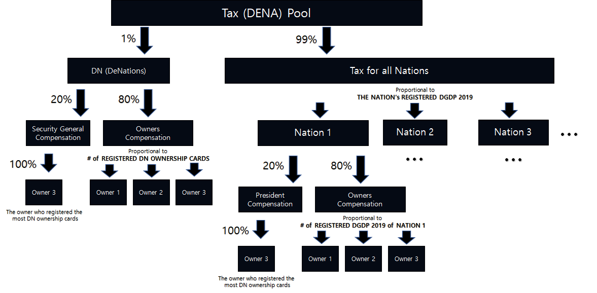
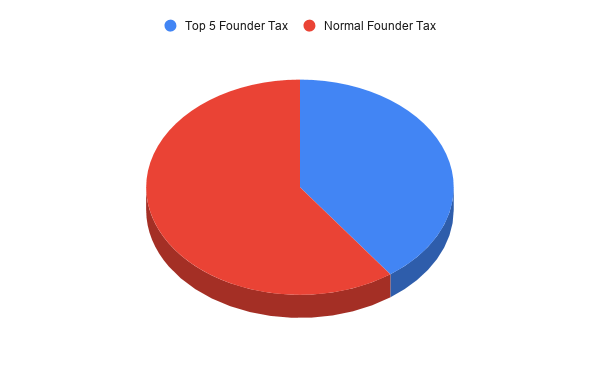
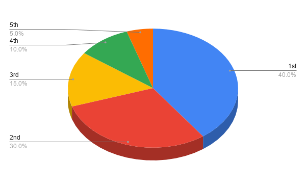

# Tax Farming(Farm with NFT)

## Description

- Cities and nations receive taxes as tokens according to their power
- the power of cities and nations is determined by many factors, including the productivity and registration status of Civilization NFT.
- There are Regular Taxes paid every block time(14 seconds) and Special Taxes paid irregularly.
- Tax is distributed to the holders of Nation/City Ownership NFT.

## Regular Tax

- The current tax pool distributes 1,500 DENA per week.
- 1 % of tax is distributed to the DeNations Ownership holders.
- 20% of tax allocated to DeNations Ownership is paid to the Secretary-General of the DeNations (who have registered the most # of DeNations Ownership NFTs)
- 80% of tax allocated to DeNations Ownership is paid to the owners of DeNations Ownership holders in proportional to their # of registered ownerships
- 99% of tax is distributed to the Nations in proportional to their total sum of registered DGDP
- 20% of tax allocated to a certain Nation is paid to the President of the Nations (who have registered the largest DGDP of the Nation )
- 80% of tax allocated to a certain Nation is paid to the owners of Nations Ownership holders in proportional to their registered DGDP.

## Special Taxes

### a) Founder Tax

#### Definition & Source of Founder Tax

10% of sales of ownerships per round are compensated to the ownership owners of the previous round. This reward is defined as the Founder Tax

#### Founder Tax Distribution

40% of the Founder Tax (Top 5 Founder Tax) will be allocated to the top 5 registered owners who own the most ownerships at the end of the previous round. 60% of Founder Tax (Normal Founder Tax) will be distributed in proportion to the number of ownerships registered at the end of the previous round. When there is a tie, the owner who registered their last ownership earlier takes the higher rank.

#### Time of the Measurement

The status of the registered Nation Ownerships is measured when the next round starts(to give you a time for registration after the previous round ends) and this status determines the distribution of the founder tax reward for the current round.

#### Register Nation Ownerships to Qualify

You need to register your Nation Ownerships to qualify to receive Founder Tax.

#### Tax Reward Date

The reward will be paid within 28 days after the end of the round (when the last Nation Ownership of the round is sold).

#### Exceptions

DeNations Ownerships & Myanmar Ownerships are excluded. 

#### Example

- John registered 50 Ownerships (out of 190 total registered) of France when the last France Ownership is sold for round 2 (end of round 2).
- John owns the 2nd largest number of France Ownerships at the end of round 2.
- 85 new France Ownerships are sold (which excludes resale) during the 3rd round. The total sales amount was 100 ETH.
- Founder tax reward for John at round 3 will be 1.39 ETH which includes normal Founder Tax (0.79 ETH=50 ETH*10%*60%*(50/190)) and Top 5 Founder Tax (0.60 ETH=50 ETH*10%*40%*30%).

### b) Art Tax

20% of DeNations Art Fund generated from a certain art block, will be distributed to the Nation Ownership holder of the artist's belonging nation.  

### c) Civilization Tax

20% of Civilization NFT revenue will be distributed to the Nation Ownership holder of the Civilization's belonging nation.