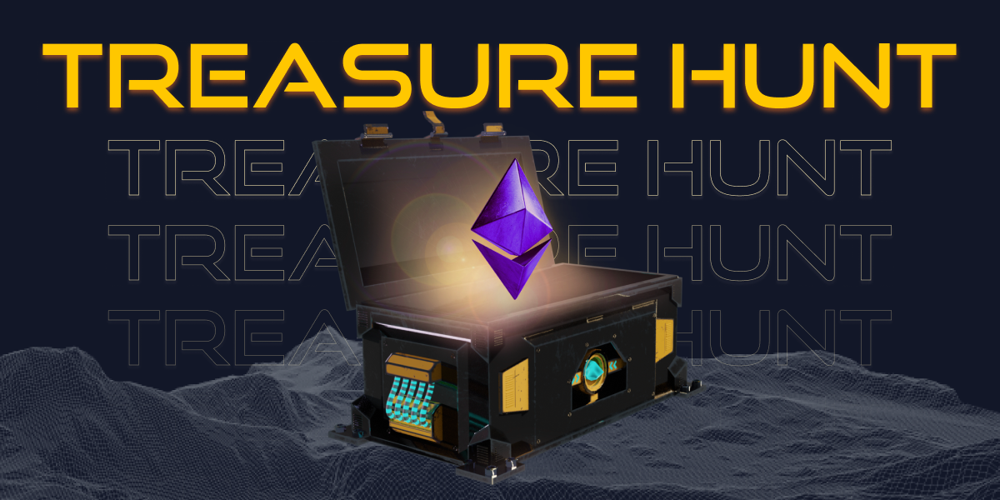

# Treasure Hunt

DeNations user who mint land during ‘Treasure Hunt’ will get special rewards. The treasure boxes will be randomly distributed throughout the mintable lands, and user can hunt for high-valued treasure by figuring out the location hint and minting the land prior to other users.

## Description

- Every land has hidden treasures during the ‘Treasure Hunt’ land minting round. Only the landowner who mint the land can open the treasure box.
- The landowner will have a choice of 3 treasure boxes with different treasures inside. The treasure is sent directly to the landowner’s wallet once opened.

## Treasures

- The 1st treasure is Wrapped Ether (WETH). The treasure can be up to 0.1 WETH. The total number of WETH for treasures will be different depending on the minting round.
- When the treasure hunt starts, the map will be updated with the list of top ranked hidden treasures and the status of treasure hunting.
- The distribution of treasures among the lands is completely random. Therefore, you will have a chance to find a high-valued treasure in a low-level land.