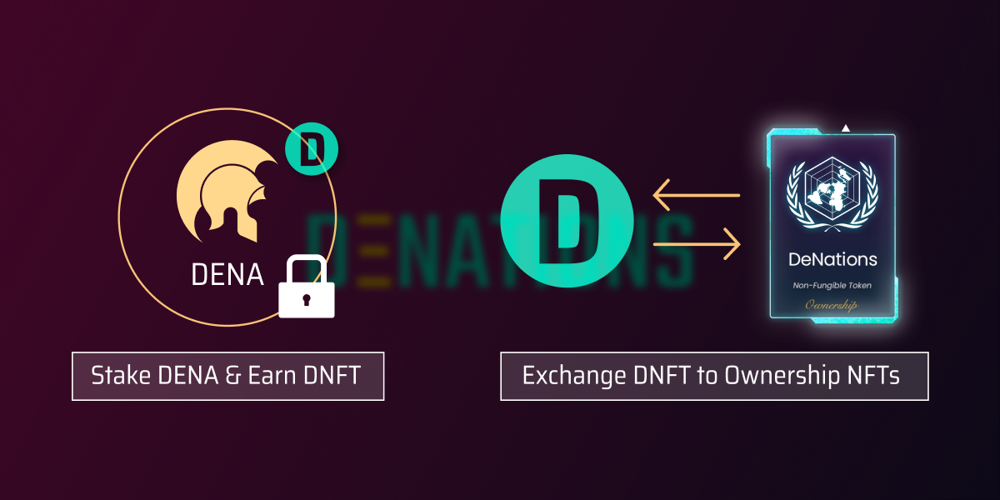

# DNFT Token

## Usage

1. [Mint Ownership NFTs with DNFT](https://denations.typeform.com/to/VPHHZ5be)

## How to Earn

1. [Buy DENA](https://app.uniswap.org/#/swap?outputCurrency=0x15F0EEDF9Ce24fc4b6826E590A8292CE5524a1DA&use=V2) or [Farm DENA](https://finance.denations.com/#/dena)
2. [Farm DNFT by depositing DENA](https://finance.denations.com/#/nft)

## About DNFT Farm

### 500 DNFT per Week

A total of 500 DNFT (DeNations Nation Founding Token) will be distributed equally over the week in proportion to the amount of DENA staked. The weekly rate may be adjusted to a higher number.

### 1 DNFT =~ 1 DGDP

With earned 100 DNFT, you may exchange approximately 100 DGDP worth of Nations Ownership. However, there might be exceptions.

### 100 DNFT per 1 DeNation Ownership

50 [DeNations Ownership](https://www.notion.so/96eaf67f8e1b8bc494d3863863c1f8ed) NFTs will be allocated for the start, priced at 100 DNFT per 1 [DeNations Ownership](https://www.notion.so/96eaf67f8e1b8bc494d3863863c1f8ed). We may add more exotic Nation Ownerships buyable /exclusively buyable with DNFT.