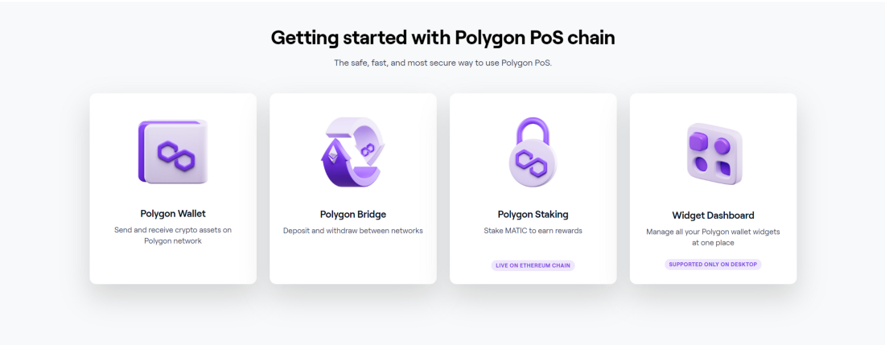
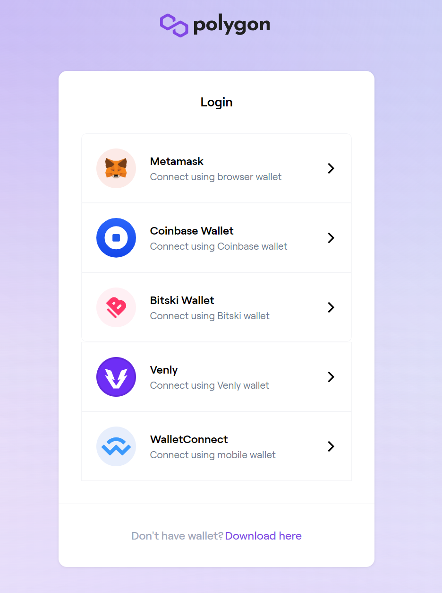
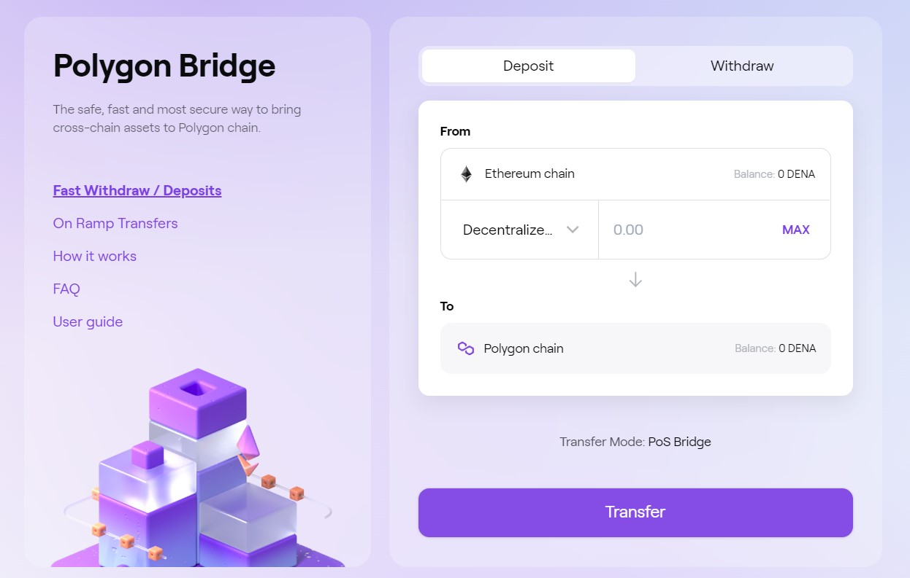

# How to get Polygon DENA

First, you need to get DENA. Check the guide on [how to get DENA.](/docs/tutorial/metaverse/Deposit%20DENA%20to%20Metaverse)

Then, follow the steps below to get Polygon DENA.

**Step 1.** Navigate to [Polygon Bridge](https://wallet.polygon.technology/bridge) ([https://wallet.polygon.technology/bridge](https://wallet.polygon.technology/bridge))

**Step 2.** Connect your wallet

**Step 3.** Transfer DENA to Polygon chain(DENA token address: 0x15F0EEDF9Ce24fc4b6826E590A8292CE5524a1DA)

**Step 4.** Check your transfer overview.