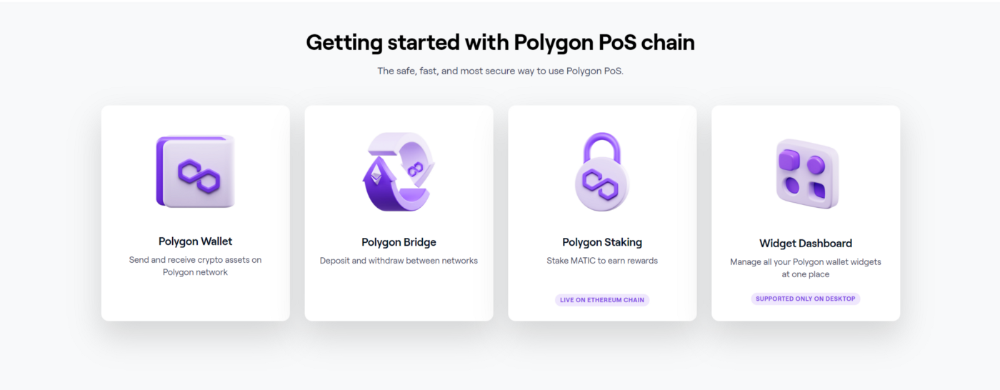
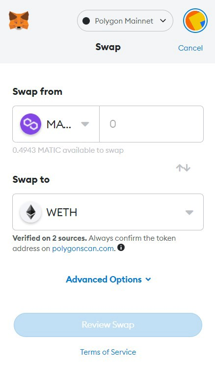

# How to get WETH

This guide shows how to get WETH. There are two ways to do this.

## How to get WETH by using Polygon Bridge

**Step 1.** Navigate to [Polygon Bridge](https://wallet.polygon.technology/bridge) ([https://wallet.polygon.technology/bridge](https://wallet.polygon.technology/bridge))

**Step 2.** Connect your wallet

**Step 3.** Transfer ETH to WETH

**Step 4.** Check your transfer overview

## How to get WETH with low transaction fees

**Step 1.** Buy MATIC on any crypto exchanges.

**Step 2.** Withdraw MATIC to your Metamask

** You must set up & send it to Polygon Network.

**Step 3.** Swap MATIC to WETH on Metamask.

