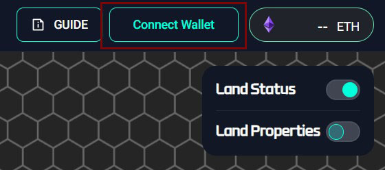
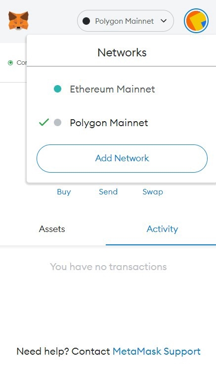
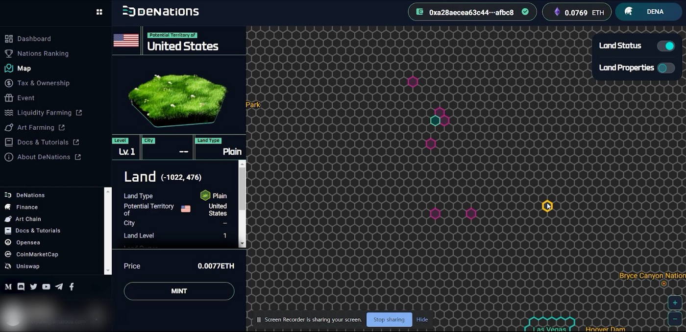
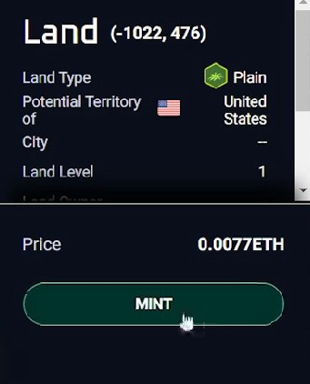
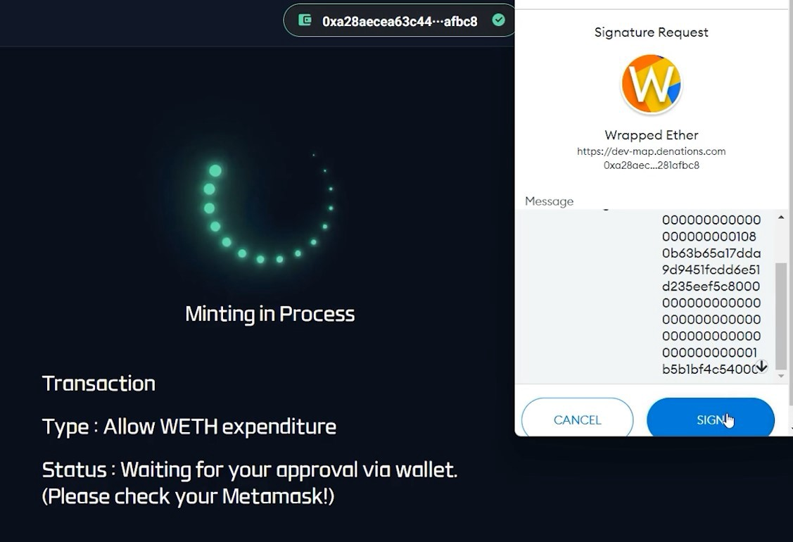
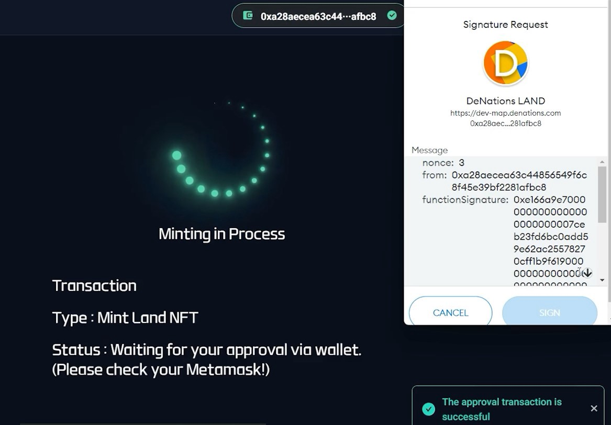
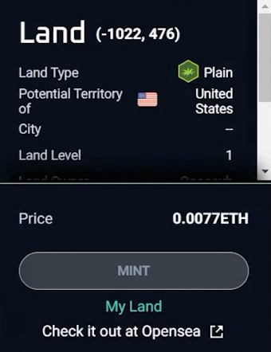
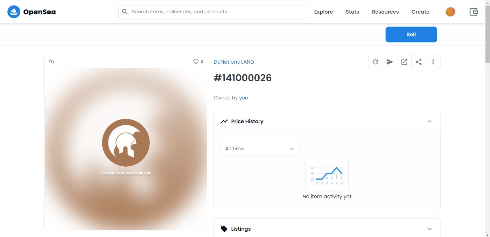

# Land Minting Guide

This guide shows how to mint DeNations Lands.

**Step 1.** Connect Wallet on Land Map.

**Step 2.** Change your network to Polygon.

** If you did not change your network to Polygon, please approve the request when the website tries to register or switch to the Polygon network.

**Step 3.** Select the land you would like to mint.

**Step 4.** Click ‘Mint’.

**Step 5.** ****Accept Wrapped Ether (WETH) Transaction.

** **We pay the transaction fees for you.**

When you mint, there will be a request for a Wrapped Ether(WETH) Transaction before the Land Mint Transaction. Please accept the request and allow WETH expenditure so that we can make the transaction for you.

**Step 6.** Accept Land minting transaction.

**Step 7.** Land Minting is in process.

.jpeg)

**DO NOT refresh the page when minting is in process.

**Step 8.** The land will appear as ‘My Land’ after minting.

**Step 9.** Check your land on Opensea

Note: Your land may appear on Opensea like the screen below. This is NOT a minting error. The Opensea website needs some time to process, so please wait and check back later.

## **IMPORTANT**

✔️MetaMask account must match with the registered account on DeNations.

✔️Make sure you have enough funds before the minting starts.

✔️If you come across ‘invalid address’ or ‘ENS name’ errors, it is highly likely that it is a MetaMask issue. When this happens, try deleting the Polygon Mainnet network and re-add it after. If this does not work, please try re-installing MetaMask.