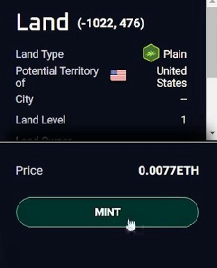
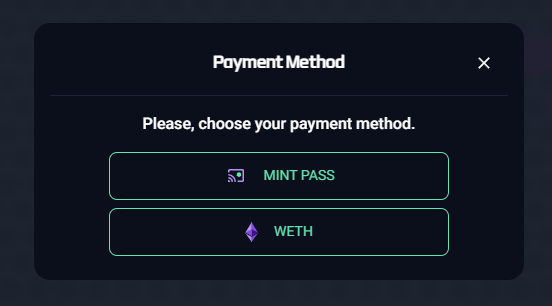
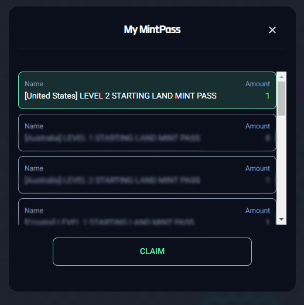
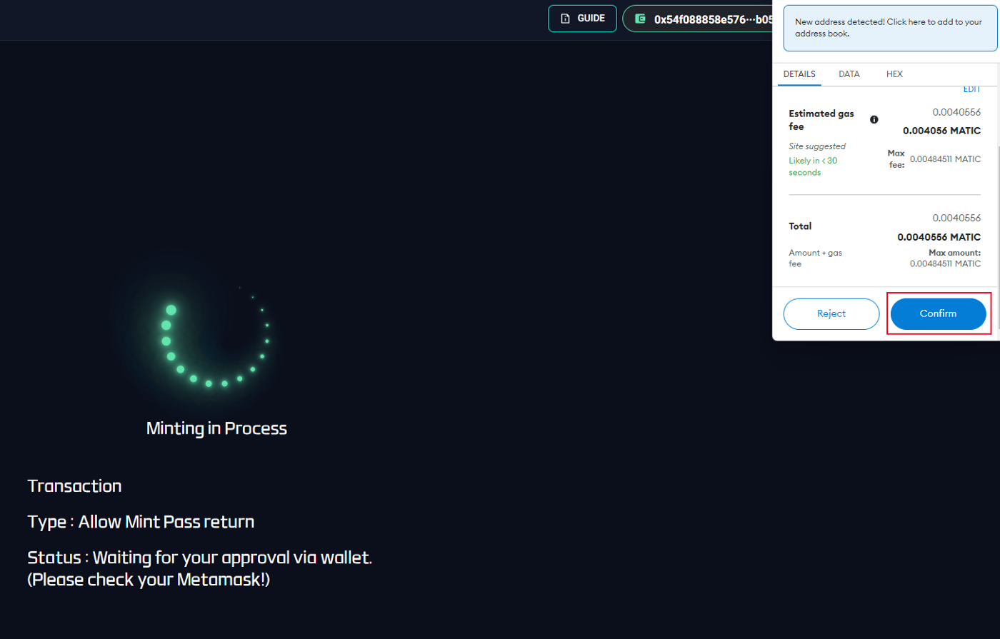
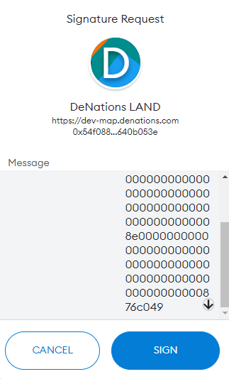

# Mint Pass Claim Guide

## Mint Pass Claim Tutorial

**Step 1**. Connect wallet

- Make sure you switch to the Polygon network
- The address has to be registered on DeNations

**Step 2.** Select the land you want to mint.

**Step 3.** Click ‘Mint’.

**Step 4.** Select the “Mint Pass” for the payment method.

**Step 5.** Select your Land Mint Pass that you want to use for the minting.

**Step 6.** Confirm gas fee on Metamask pop-up.

**Step 7.** Accept Transaction on Metamask pop-up.

