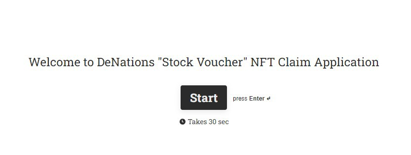
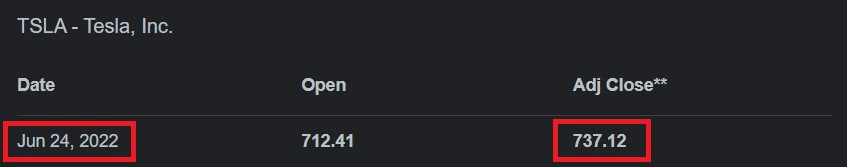
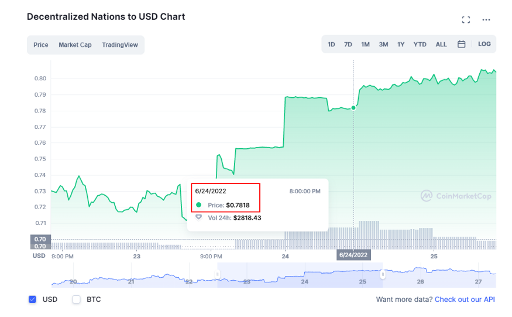

# Stock Voucher Claim Guide

# Rules

- “Stock Voucher” is only valid for 180 days and can be traded on Opensea before the expiration date.
- **The stock price in DENA corresponds to the following trading day’s closing price of the application date.** DENA price will be based on CoinMarketCap. The DENA price snapshot will be taken at the closing time of the claimed stock.* Application date is based on UTC timezone.
- DENA will be delivered within 14 days after the application date.

## Claim Guide

### Step 1

On June 23rd, the holder submitted the application for claiming a “Stock Voucher” with 1.2 shares of Tesla Stock

→ [https://form.typeform.com/to/ggZcGyP8](https://form.typeform.com/to/ggZcGyP8)

.

### Step 2

Send “Stock Voucher” NFT to **0x7D0cB47891258866abfaDfFc346b429778299B2A**

### Step 3

On **June 24th 2022**, Tesla's stock closing price was 737.12 USD.

→ 1.2 shares of Tesla stock = 884.544 USD

→ The holder would receive **884.544 USD (1.2 shares) in DENA**.

### Step 4

DENA price snapshot is taken at **8:00 PM UTC (NASDAQ closing time) on June 24th**.

→ The holder would receive approximately **1,131.42 DENA** within 14 days.

