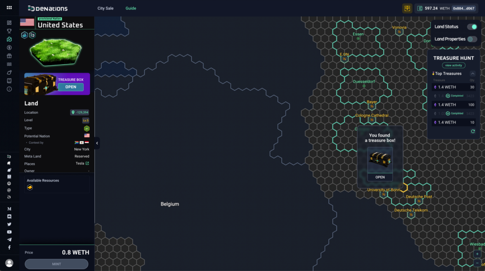
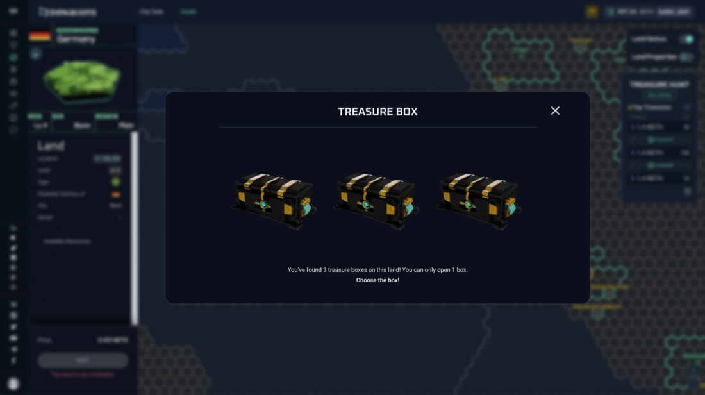
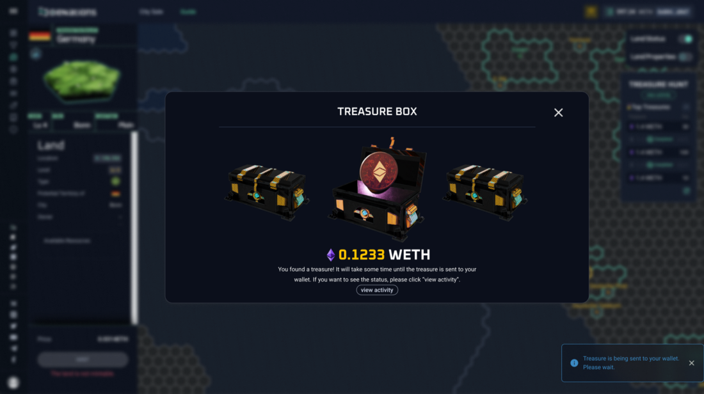
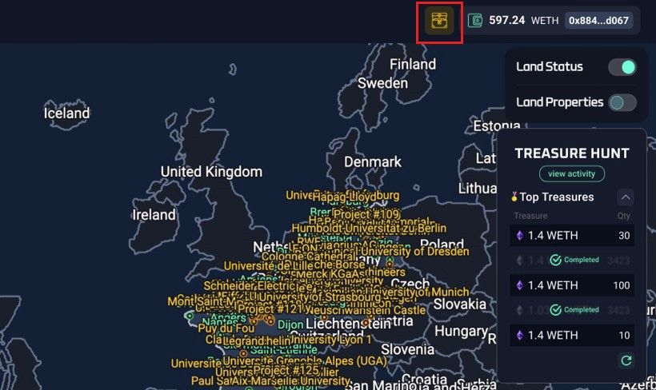
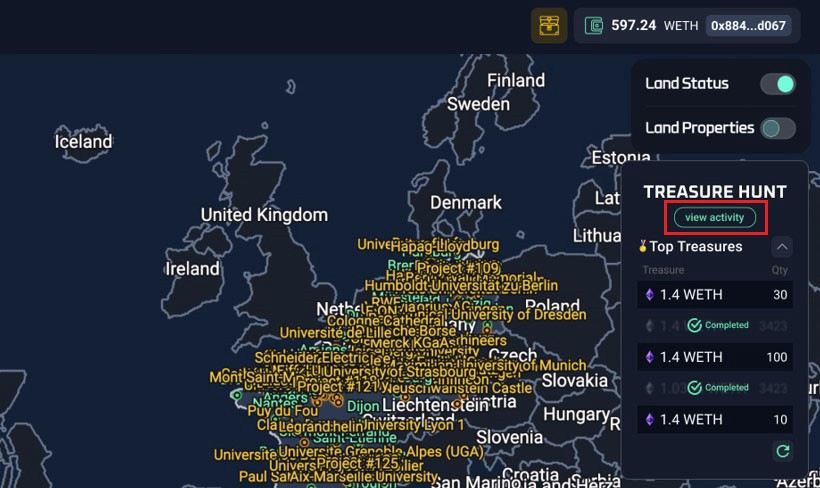
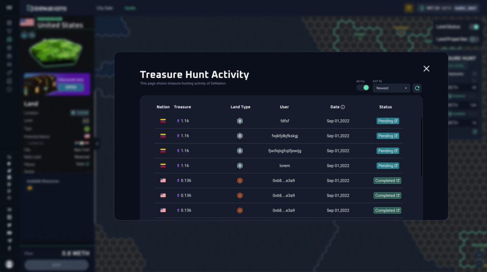
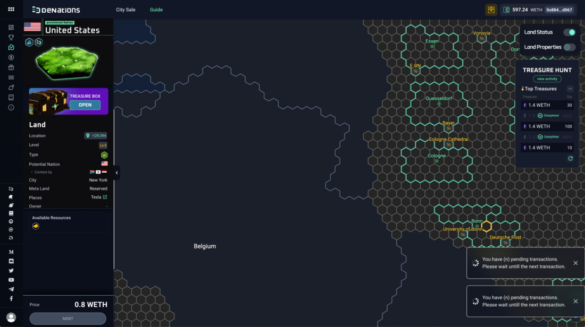
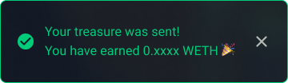
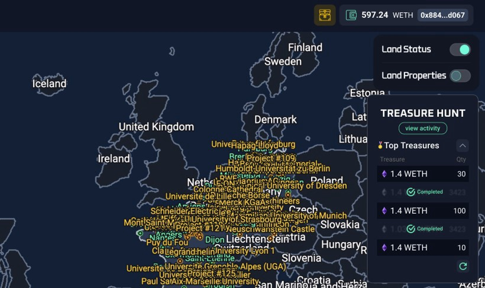

# Treasure Hunt

This tutorial will guide you on how to hunt for treasures in the DeNations map.

**Step 1.** Select your land and click ‘OPEN’.
→ You must be the owner of the land to open the treasure box.

**Step 2.** Choose from the 3 treasure boxes that appear on the screen. You can only choose 1 treasure box.

**Step 3.** Check the amount of WETH you found in the treasure box.

→ It will take some time until the treasure is sent directly to the landowner’s wallet.

**Step 3-1.** Click on the treasure box icon to see your treasure hunting activities.

→ You can check the entire ‘Treasure Hunt’ activity status by clicking on the ‘view activity’ button on the ‘Treasure Hunt’ tab. 

**Step 3-2.** You can mint other lands and open other treasure boxes while the previous transactions are still pending.

Transaction status notifications on the lower right corner

**Step 4.** You will get a notification when your treasure is sent to your wallet.

**TIP:** A list of top-ranked treasures is available on the ‘Treasure Hunt’ tab.

‘Treasure Hunt’ tab on the right side of the map