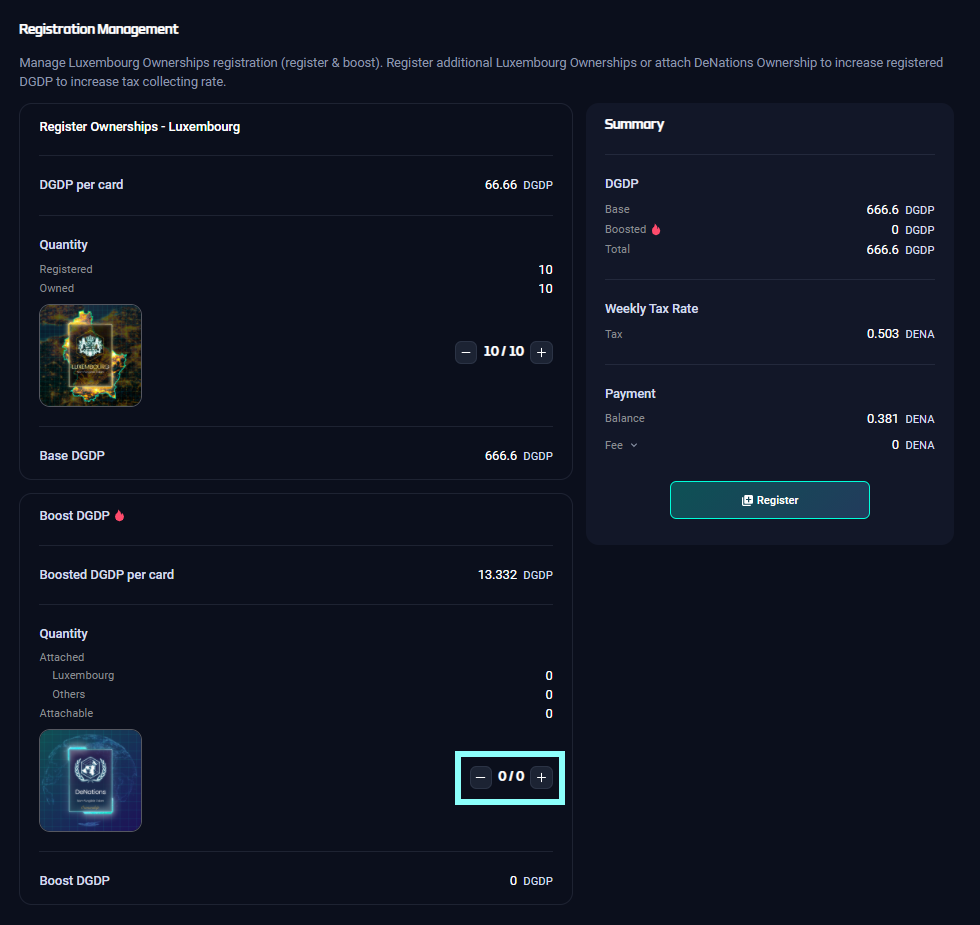

# Boost/Unboost NFT

## Purpose

- Combining your Nation Ownership NFT card with a DeNations(DN) Ownership NFT card, you can **increase your Nation Ownership NFT card’s DGDP by 20%.**
- Refer to [Glossary](/docs/guide/Glossary) for more details.

## How to

`Step 1.` First, you need Nation Ownership NFTs to be registered. 

`Step 2.` Click '+' sign when you want to boost Nation DGDPs by 20%.

`Step 3.` Click 'Register' button after checking the DENA amount. 

`Step 4.` Click '-' sign when you want to unboost DN from the currently attached Nation NFT.

TIP
DENA is necessary when boosting while DENA is NOT necessary when unboosting.

NOTE
You are able to detach the DN cards which were used to boost your nations, but when you sell or transfer your DN cards to others, they will be automatically detached from the order of the smallest DGDP.