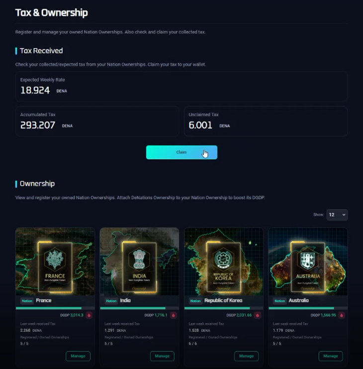

# Claim Tax

## Purpose

## How to

`Step 1.` After log-in and under the 'Tax & Ownership' section, check your accumulated DENA.

`Step 2.` Click 'Claim'.

`Step 3.` Click 'Approve' after checking the unclaimed amount of DENA.

:::info INFORMATION

Gas fee or transaction fee are NOT necessary.

:::