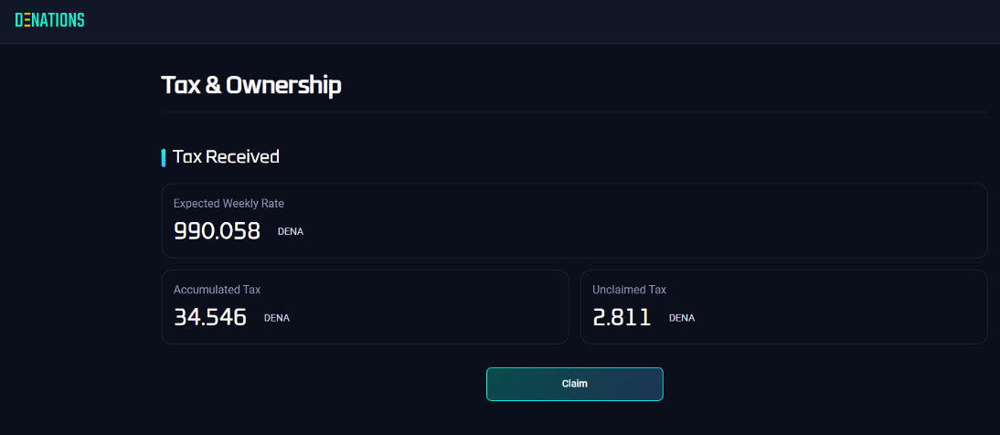
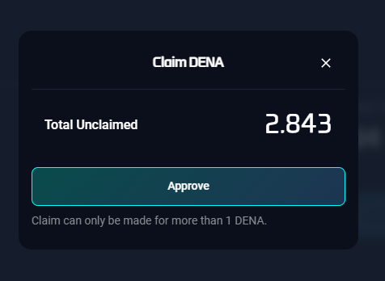

# Claim Tax

## How to

`Step 1.` Click 'Tax & Ownership'

`Step 2.` Under the 'Tax Received' section, click the ‘Claim’ button when you want to withdraw the accumulated tax in DENA.

`Step 3.` Click 'Approve' after checking the unclaimed DENA amount

:::tip 

The minimum amount of DENA = 1 to proceed ‘Claim’.

:::

