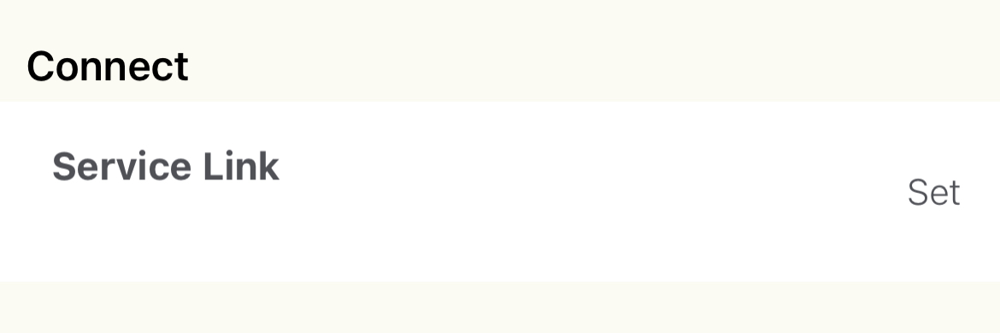
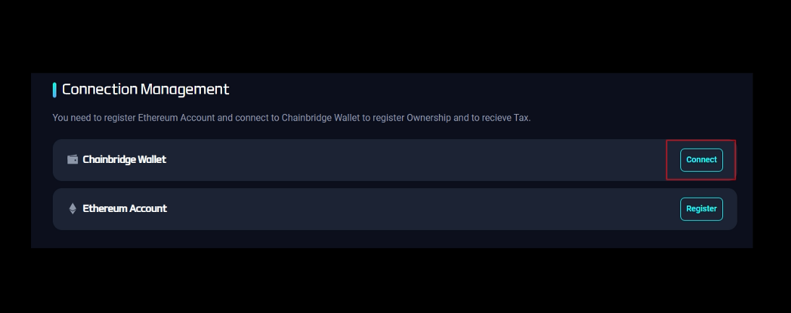
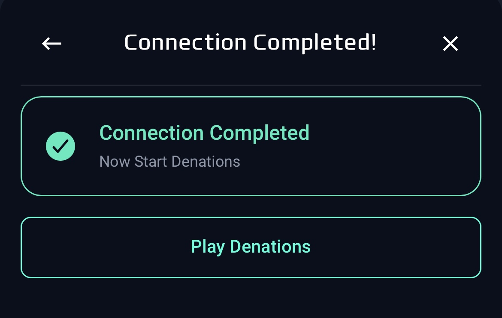

# Connect to MetaCode Wallet

## Purpose

Transaction/Gas fee is 0 within the MetaCode (Chainbridge) application. Therefore, players must need the MetaCode wallet when paying a registration fee and claiming the tax.

## How to

`Step 1.` Log into play.denations.com

`Step 2.` Click the ‘3 dots’ and ‘Settings’

`Step 3.` Stay on the ‘Connection Management’ page 

`Step 4.` Install MetaCode application on your mobile phone

- If you already downloaded and set it up, directly jump to step 6
- Otherwise, follow below steps

`Step 5.` MetaCode Sign-up & Verification

1. Open the MetaCode app
2. Sign up by email
3. Click the icon at the upper right corner to manage profiles.
4. Register your face

    :::info WHY?

    Face verification step is required in order to make sure that one person has a single account only and not to abuse fake accounts. Saved data  will be encrypted and will never be leaked.

    Look straight ahead, fit your face into the square frame and follow the instructions.

    :::

5. Verify your email
6. Set up a 4 digit security password
7. Verify your mobile phone number
8. Then you can check your digital assets in the MetaCode wallet

    

`Step 6.` Service Connection

1. Below ‘Connect’, click ‘Set’

1. Click ‘Connect service’

1. Back to ‘Connection Management’ page of play.denations.com
2. Click ‘Connect’ for the ChainBridge Wallet

1. Follow the instructions
2. Get the authentication number by pressing download icon

1. Enter the authentication number in the MetaCode app and click 'Connect to service'

1. Connection completed

:::info Final

Finally, you can freely explore the Market, Tax&Ownership, and Liquidity Farming menu.

:::
