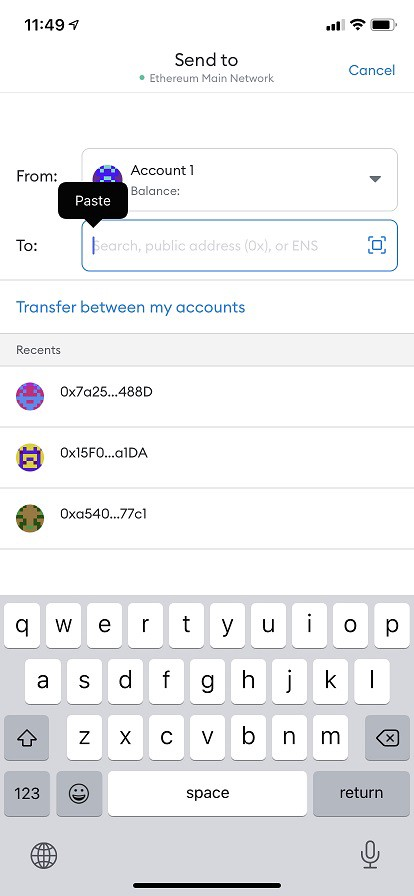

# Get DENA Ready

## Buy DENA

### How to

`Step 1.` Go to [Uniswap](https://app.uniswap.org/#/swap?outputCurrency=0x15F0EEDF9Ce24fc4b6826E590A8292CE5524a1DA) 

`Step 2.` If the screen below appears, check the 'I understand' box and click the 'Continue' button

`Step 3.` Press the 'Connect Wallet' button to link your Metamask Wallet

`Step 4.` Metamask will ask if you want to connect to Uniswap. Select the account you want to connect to and click Next to complete the connection

`Step 5.` Choose each drop-down menus to set desired token type (i.e. From: ETH and To: DENA)

- DENA address: 0x15F0EEDF9Ce24fc4b6826E590A8292CE5524a1DA

    

`Step 6.` Input the amount you are willing to change to DENA

`Step 7.` Click 'Swap' button

`Step 8.` Check the confirmation notification with summary and click 'Confirm Swap'

`Step 9.` When the transaction confirmation window appears in your wallet extension, check the Gas Fee amount and click 'Confirm'

`Step 10.` After a few minutes, the purchased DENA will be sent to your wallet. You can find it in the Asset and Activity window of your wallet.

## Charge DENA to play.denation.com

### How to

`Step 1.` Log in ChainBridge 

`Step 2.` Under ‘Wallet’ tab, click Decentralized Nations

`Step 3.` Click ‘Receive’ button to transfer DENA from ChainBridge to play platform

`Step 4.` Click ‘Copy wallet address’ or use QR code provided

`Step 5.` Switch to the Metamask app

`Step 6.` If the DENA token is not registered on the list, click ‘Add tokens’

`Step 7.` Click the ‘Custom token’ and fill the blanks

`Step 8.` Input DENA Token Address: **0x15f0eedf9ce24fc4b6826e590a8292ce5524a1d**

`Step 9.` Now back to the main screen and click ‘Send’

`Step 10.` Paste the copied DENA wallet address from the ChainBridge

`Step 11.` If you also see that notification, you are good to go ‘Next’

`Step 12.` Click the token type dropdown, and change it to DENA

`Step 13.` Set the amount you are willing to send and click 'Next'

`Step 14.` Confirm the amount and gas fee again and click 'Send'

:::info Transfer Success

When DENA is successfully transferred to your ChainBridge wallet, it will reflect on the [play.denations.com](http://play.denations.com/)
 
:::