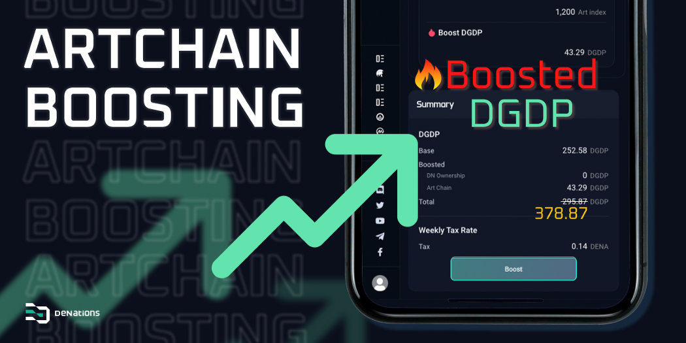
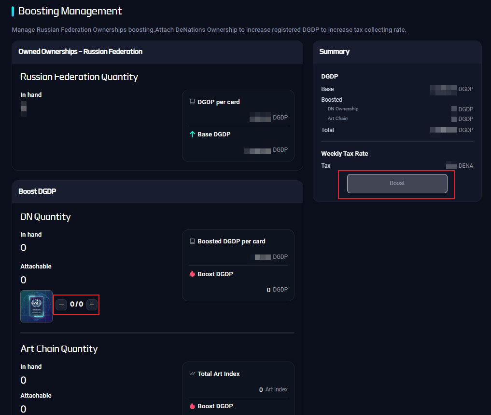

# NFT Boosting Feature

## DN Card

Combining your Nation Ownership NFT card with a DeNations(DN) Ownership NFT card, you can **increase your Nation Ownership NFT card’s DGDP by 20%.**

For more details :

```mdx-code-block
import {InternalLinkCard} from '@site/src/components/Link/Card'

<InternalLinkCard title="Glossary" to="/docs/guide/Glossary" style={{margin: '1rem 0'}}/>
```

## Art Boosting

Art NFT can boost DGDP up to 5% of its art index.



### Boosting Tips

**Tip 1**— Higher art index gives you more boost.

**Tip 2**— Higher art boost percentage when you attach the Art NFT to nations with higher DGDP.

For example, the art index of LOST is 3,000. If you attach the LOST to the United States NFT, the DGDP will raise by 150 (5% of 3,000). However, the percentage of increase rate of total DGDP might be low since DGDP of the United States is already high.

**Tip 3** — Higher percentage increase rate of total DGDP when you attach the Art NFT to nations with lower DGDP.

For example, the art index of LOST is 3,000. If you attach the LOST to the Tuvalu nation ownership NFT (nation w/ low DGDP), the total DGDP will raise by approximately 2300%. LOST NFT will boost 1.3%(39.8) of its art index when you attach it to the Tuvalu nation. However, boosted DGDP is much higher than the original DGDP since DGDP of 1 Tuvalu nation ownership card is only 1.72.

**DeNations’ players can strategically decide which nations to attach in order to earn more passive income.**

## How to

`Step 1.` First, you need Nation Ownership NFTs to be registered.

`Step 2.` Click '+' sign when you want to boost Nation DGDPs by 20%.

`Step 3.` Click 'Boost' button after checking the DENA amount.

`Step 4.` Click '-' sign when you want to unboost DN from the currently attached Nation NFT.



:::tip

DENA is necessary when boosting while DENA is NOT necessary when unboosting.

:::

:::caution NOTE

You are able to detach the DN cards which were used to boost your nations, but when you sell or transfer your DN cards to others, they will be automatically detached from the order of the smallest DGDP.

:::
