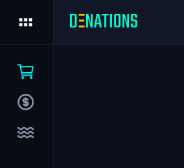
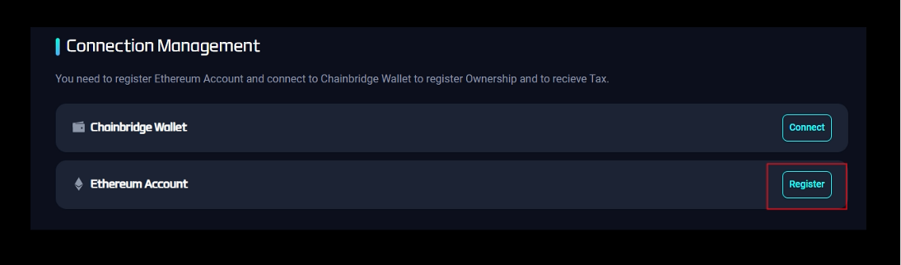
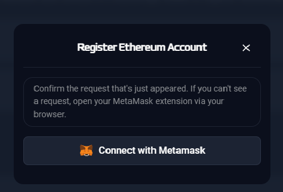

# Register Ethereum Account

## Purpose

In order to synchronize NFTs into your ETH account & connect to an ETH network 

## How to

`Step 1.` Log in 

`Step 2.` Click the cube at the top left corner, then the menu will be opened   

`Step 3.` Click the ‘3 dots’ and ‘Settings’

`Step 4.` Under the ‘Connection Management’ section, click 'Register'

`Step 5.` Register Ethereum account using Metamask

