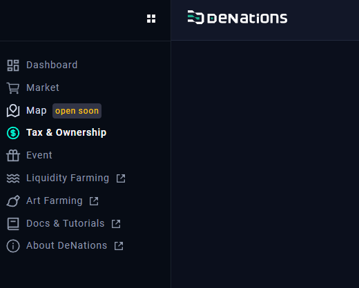
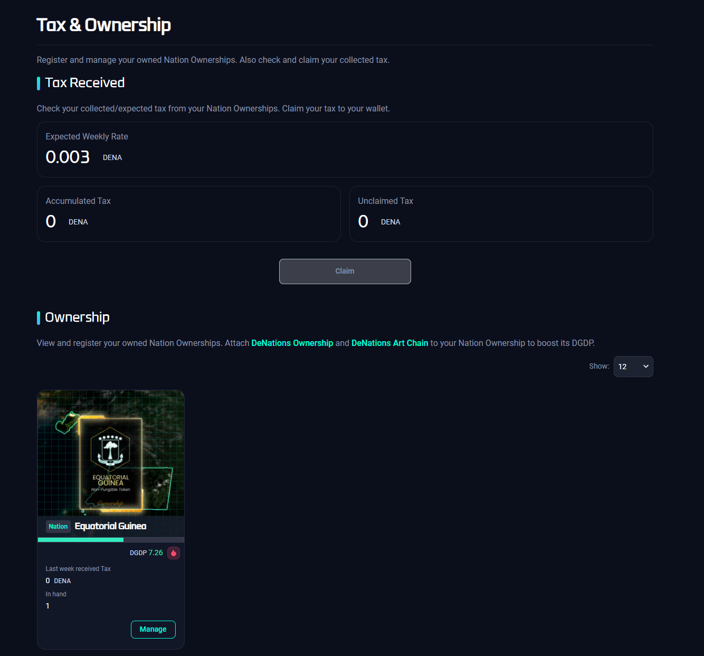

# Register Ownership (NFT)

## Purpose

### Why encourage "Register Ownership"?

- **Tax Farming**: similar DeFi concept to the liquidity mining or yield farming as you register your NFTs (among Nation, DN, and Art) and get Tax (in DENA) as a reward.
[https://smatoos.medium.com/tax-farm-increase-policy-84b187cabc78](https://smatoos.medium.com/tax-farm-increase-policy-84b187cabc78)
- **Founder Tax**: 10% of sales of ownerships per week is accumulated and distributed to the players who registered at the beginning of the week. This reward is defined as the Founder Tax.
[https://medium.com/denations/policy-updates-weekly-founder-tax-33cd81dbc5fe](https://medium.com/denations/policy-updates-weekly-founder-tax-33cd81dbc5fe)

## How to

Nation Ownership NFTs registration is currently automatic.

`Step 1.` Make sure you have your Ethereum account registered and connected to Chainbridge wallet(Tutorial on how to register and connect on ‘Setup wallets’ page).

`Step 2.` Click on the ‘Tax & Ownership’ tab on the menu.

`Step 3.` Tax and registered nation ownership NFT will appear on the page.

