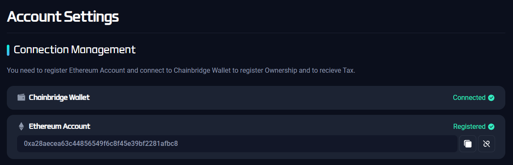

# Register Ownership (NFT)

## Purpose

Why encourage "Register Ownership"?

- **Tax Farming**: similar DeFi concept to the liquidity mining or **yield farming** as you register your NFTs (among Nation, DN, and Art) and get Tax (in DENA) as a reward.
[https://smatoos.medium.com/tax-farm-increase-policy-84b187cabc78](https://smatoos.medium.com/tax-farm-increase-policy-84b187cabc78)
- **Founder Tax**: **10% of sales** of ownerships per round are **compensated** to the Ownership owners of the previous round. This reward is defined as the Founder Tax. 
[https://smatoos.medium.com/founder-tax-policy-931d72ea1195](https://smatoos.medium.com/founder-tax-policy-931d72ea1195)

## How to

`Step 1.` Go to the main page 

- If you already have Ownership NFTs, click the 'Register' button
- If not, select the nation you want to own, click the 'Buy' button which will direct you to the DeNations Collection page at OpenSea

`Step 2.` Click the ‘Register’ button of the nation you want to see in detail

`Step 3.` Check the current summary of the selected nation

- Detail information about tax compensation, DGDP, owners, and the president is included

`Step 4.` Click the ‘Register My Ownerships’ or Scroll down

`Step 5.` Click the ‘+’ sign and check the weekly tax rewards in the summary  

`Step 6.` Click ‘Register’ when satisfied & ‘Waiting for approval’ statement will be shown

`Step 7.` Check your ChainBridge application using a mobile phone

`Step 8.` Approve the DENA withdrawal

`Step 9.` Back to the page & Click ‘Confirm’