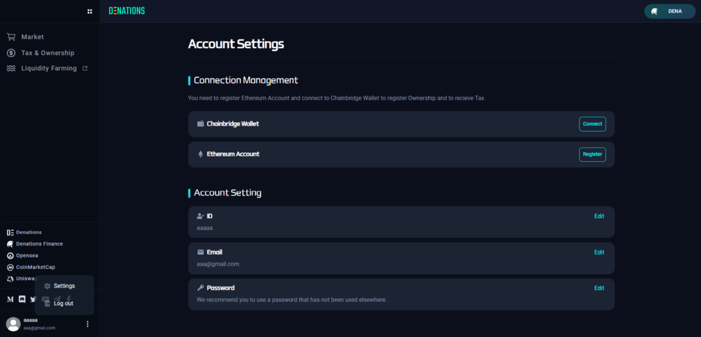
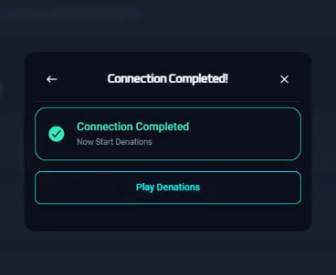

# Set up wallets

## Ethereum & Metamask

### Purpose

In order to synchronize NFTs into your ETH account & connect to an ETH network 

### How to

`Step 1.` Log in 

`Step 2.` Click the cube at the top left corner, then the menu will be opened   

`Step 3.` Click the ‘3 dots’ and ‘Settings’

`Step 4.` Under the ‘Connection Management’ section, click 'Register'

`Step 5.` Register Ethereum account using Metamask

## Chainbridge

### Purpose

Transaction/Gas fee is 0 within the ChainBridge application. Therefore, players must need the ChainBridge wallet when paying a registration fee and claiming the tax.

### How to

`Step 1.` Log in 

`Step 2.` Click the cube at the top left corner, then the menu will be opened

`Step 3.` Click the ‘3 dots’ and ‘Settings’

`Step 4.` Stay on the ‘Connection Management’ page

`Step 5.` Install ChainBridge application on your mobile phone

- If you already downloaded and set it up, directly jump to step 7
- Otherwise, follow below steps

`Step 6.` ChainBridge Sign-up & Verification 

1. Open the ChainBridge app
2. Click 'Sign up by email'
3. Enter your name, email, and password
4. Click the icon at the upper right corner to manage profiles.

1. Register your face
    - Why?

        *Face verification step is required in order to make sure that one person has a single account only and not to abuse fake accounts. Saved data  will be encrypted and will never be leaked. 

        *Look straight ahead, fit your face into the square frame and follow the instructions.

2. Verify your email
3. Set up a 4 digit security password
4. Verify your mobile phone number
5. Then you can check your digital assets in the Chainbridge wallet

`Step 7.` Service Connection 

1. Swipe to the rightmost menu and click the ‘Connect’

1. Click ‘Connect to service’
2. Back to ‘Connection Management’ page in order to connect to service

1. Click ‘Connect’ for the ChainBridge Wallet

1. Follow the instructions
2. Get the authentication number by pressing download icon

1. Enter the authentication number in the app and click 'Connect to service'

1. You will see this screen when you are successfully connected to the Smatoos Wallet. Additionally, you will receive 2000 SMTS in ChainBridge as a reward.

> Finally, you can freely explore the Market, Tax&Ownership, and Liquidity Farming menu.