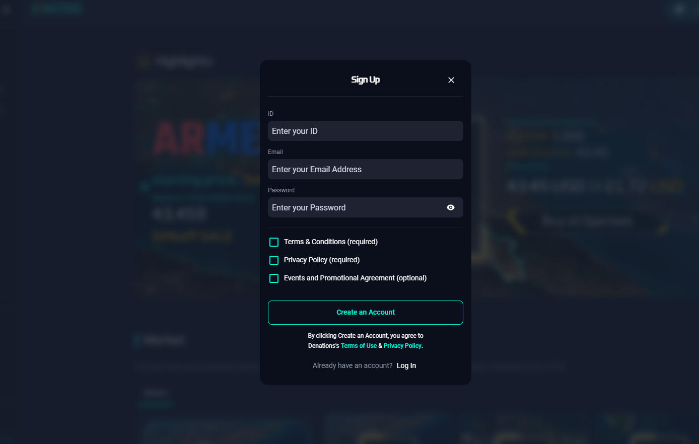
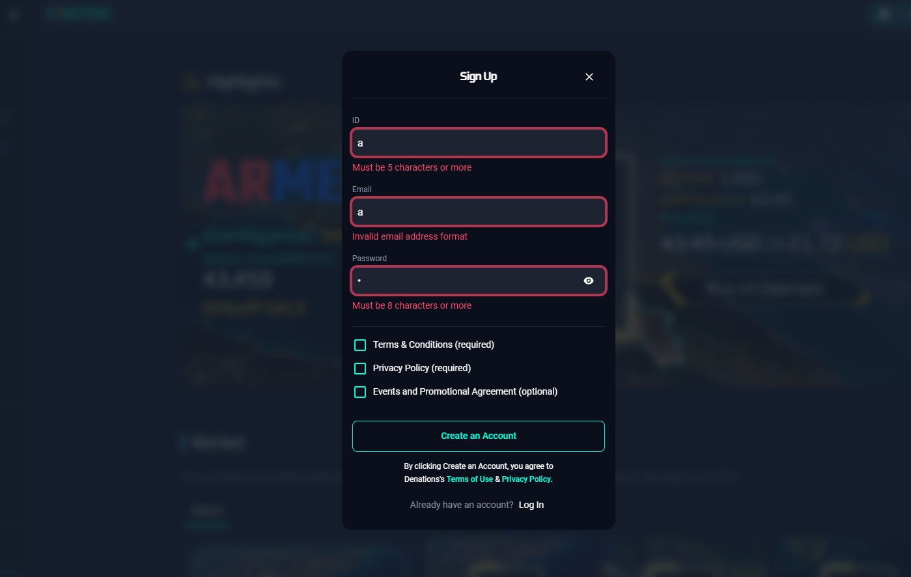

# Sign-up & Log-in

## How to

`Step 1.` Click 'Sign up'

`Step 2.` Enter ID, Email, and Password in the blanks

`Step 3.` Check the boxes and click 'Create an Account'

Must use a valid email address since the ID/PW retrieval email will be sent to the saved address in case you forget the ID/PW.

Boxes in red with notification means that condition is not met, please check again and fill it out according to the criteria.

For the **existing users** who signed up by using their emails, input your **email address as your ID.**

