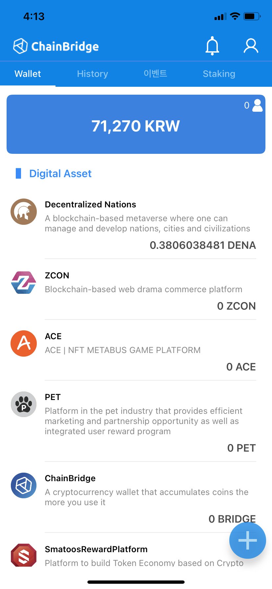
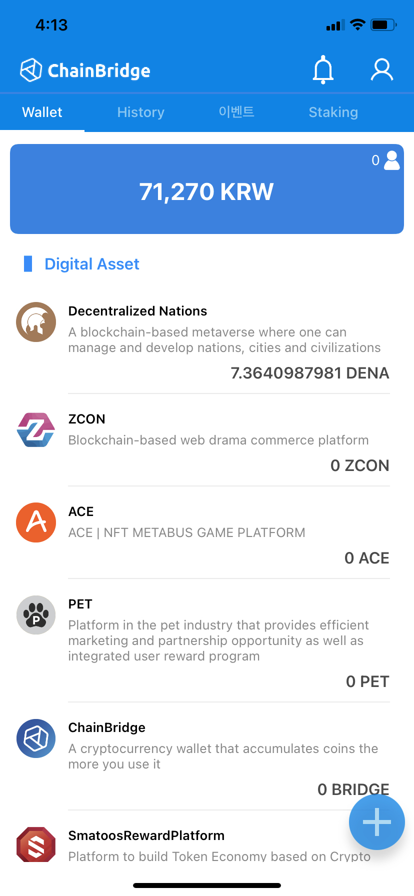
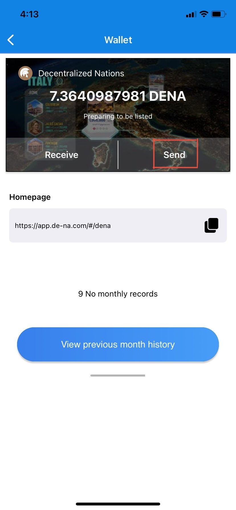
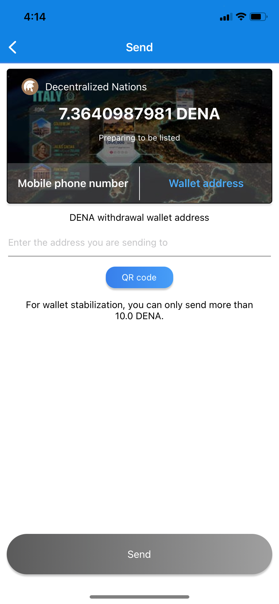

# Withdraw DENA to Ethereum Address

## Purpose

## How to

`Step 1.` After claiming tax, DENA will be deposited. (0.38 DENA → 7.36 DENA )

`Step 2.` Click DENA (Decentralized Nations)

`Step 3.` Click 'Send'

`Step 4.` Click 'Wallet address' and Enter the ETH address.

`Step 5.` Double check the Recipient's ETH address. 

`Step 6.` Enter the amount of DENA you want to withdraw & security password.

`Step 7.` Complete face recognition step. 

`Step 8.` Check your digital wallet. DENA withdrawal has been completed.